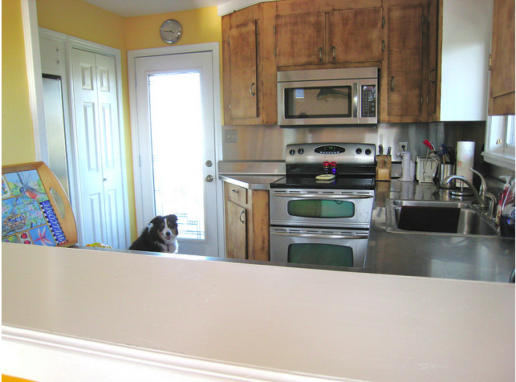

# Visual Question Answering Notes
*My notes on Visual Question Answering(VQA) papers*

**Visual Question Answering**: 
A task of correctly answering the posed question related to a given image.

For example, given a following image and asked a question "What time of the day the picture was clicked?", the VQA model should correctly answer "afternoon".

To answer the above question, the VQA model has to process the image and question simultaneously and learn to do reasoning over both modes of input. That means, VQA model has to be good at image processing task as well as natural language processing task.

---

**This repository holds the notes on Visual Question Answering papers that I found interesting.**

1.  *Ask Me Anything: Free-form Visual Question Answering Based on Knowledge from External Sources* [[link to paper](http://www.cv-foundation.org/openaccess/content_cvpr_2016/papers/Wu_Ask_Me_Anything_CVPR_2016_paper.pdf)]
    * The paper uses external knowledge base to answer any free-form questions. VQA model extracts the textual information from image and combines them with question, to predict the answer.
    * Pretrained VGG16 was used for image processing, DBpedia was used as external source. The external knowledge is encoded using Doc2Vec. Question vector along with textual information of image given to Encoder-Decoder based LSTM for predicting answer.

2.  *Image Question Answering using Convolutional Neural Network with Dynamic Parameter Prediction* [[link to paper](http://www.cv-foundation.org/openaccess/content_cvpr_2016/papers/Noh_Image_Question_Answering_CVPR_2016_paper.pdf)]
    * The VQA model needs to select different kind of information from the image based on the question asked. To incorporate this logic, authors propose a parameter prediction layer, which changes the parameters of image module(penultimate layer of VGG16) dynamically. Input to parameter prediction layer is question vector.

3.   *Stacked Attention Network for Image Question Answering* [[link to paper](http://www.cv-foundation.org/openaccess/content_cvpr_2016/papers/Yang_Stacked_Attention_Networks_CVPR_2016_paper.pdf)]
    * To answer a asked question effectively, a VQA model need to look at the right region/object in an image and extract features from that part of image. This concept of attention is implemented by the authors. Image features were extracted from VGG16 final convolutional layer(unlike usual practice of extracting from fully connected layer before softmax). 
    * Text module, that processes question, is implemented by two methods: LSTM and CNN. In case of CNN, unigram, bigram and trigram filters were used. The attention network combines the image features and question features to narrow down the region of image to most significant one.
